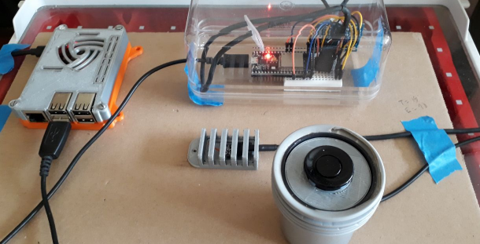
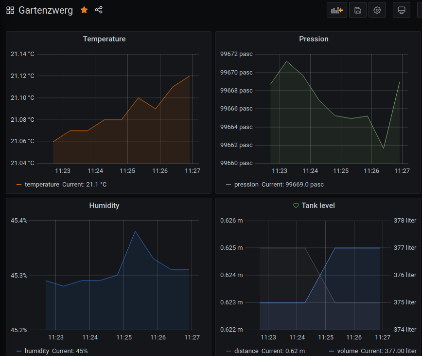

# Gartenzwerg

## About

A basic weather station using:

* an ESP32 with
    * a BMP280 sensor to get temperature, pression and humidy
    * a JSN-SR04T (HC-SR04 like) ultrasonic sensor to get water tank level
* a RPI to collect the metrics with a MQTT/Telemetry/InfluxDB/Grafana docker compose stack

The initial ESP32 code is based on the excellent [Kirill Dubovikov'blog](https://blog.kdubovikov.ml/articles/hardware/build-yourself-a-weather-station).

  
  
  

## Design Choices

- Try to improve the tank level by taking into account the temperature

- ESP32 uses MQTT to communicate with RPI

- The RPI has a Wifi Access Point, no internet connection needed

- Use docker-compose for the RPI stack

## TODO

This is still a work in progress...

- Configure RPI as AP using an extra Wifi USB
- Create script to upload data when internet is available
- Add traefik
- Auto provisioning Grafana dashboard and influxdb source
- Install RPI using ansible to setup docker and compose stack

## License

*Code in this repository is in the Public Domain (or CC0 licensed, at your option.)
Unless required by applicable law or agreed to in writing, this
software is distributed on an "AS IS" BASIS, WITHOUT WARRANTIES OR
CONDITIONS OF ANY KIND, either express or implied.*
